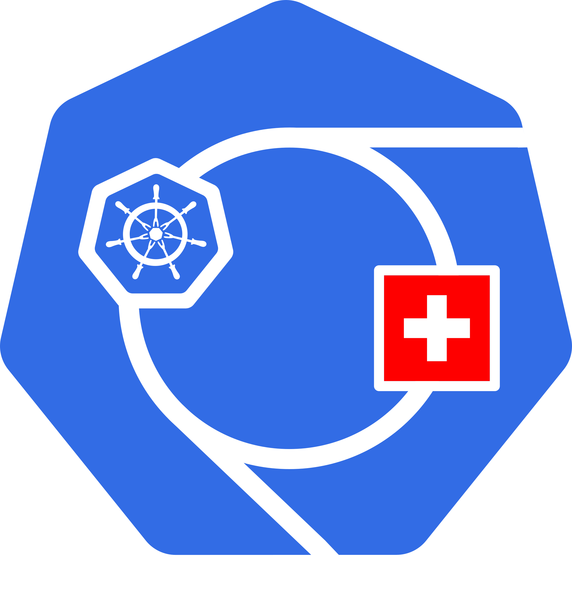

# KCD Suisse Romande 2025

In December 2025, join us at CERN for Kubernetes Community Days (KCD)!
This will be a full-day day event, focused on cloud native projects and the local community.
The talks will be in both French and English.
We plan to have about 300 participants.

KCDs are community-organized events that gather adopters and technologists from open source and cloud native communities for education, collaboration, and networking.
KCDs are supported by the [Cloud Native Computing Foundation (CNCF)](https://cncf.io/).

!!! note "Ongoing planning"

    This page is not the conference site, but an early informational resource.
    We plan to publish the conference site on [community.cncf.io](https://community.cncf.io/) in early 2025, along with other KCDs.

## Program

The program will be announced in mid-2025.
We plan for 05 December 2025, Tuesday, as the main conference day.
Some optional activities are to take place on 04 December.
Below you can see the tentative agenda, subject to change.

### Pre-Conference

- Workshops
- TBA - Optional tours to CERN and the LHC
- Speaker Dinner

### Main Day

- 2 tracks with talks in French and English
- 2 keynotes
- Lightning Talks, Tool Demos and Open Mic sessions
- TBA - workshops
- TBA - Optional tours to CERN and the LHC
- Networking in the evening

## Location

The conference will take place in [CERN Science Gateway](https://visits.web.cern.ch/science-gateway),
close to Geneva and the Geneva Airport.
You can easily get there by tram from the Geneva downtown, parkings are available too.
[How to get there](https://visit.cern/index.php/getting-here).

## Call for Papers

To be announced.

## Tickets

To be announced.

## Sponsorships

Sponsorships are to be announced!
Be sure we will be looking for some.
If you are interested, reach out to `contact at cloud-native-romandy.ch`.

