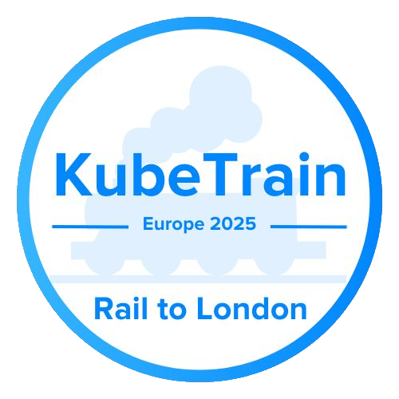
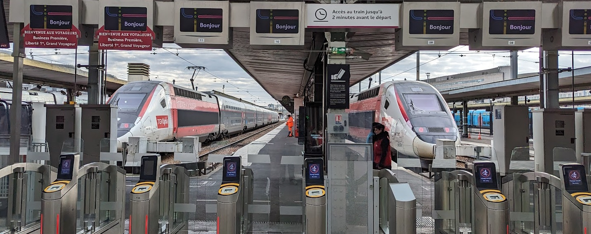

# KubeTrain 🚅

Going to Kubecon | CloudNativeCon Europe?
  Consider hopping on a KubeTrain!

[KubeTrain](https://kubetrain.io/) is an initiative to bring fun and sustainable travel to all KubeCon attendees.
The aim of this initiative is to organize groups of people that are willing to travel to the next destination of KubeCon by train.
Our association helps to coordinate a KubeTrain from Lausanne and Geneva.

## Booking

Association Cloud Native Suisse Romande does not currently handle centralized bookings.
Please book the train rides on your own, following the recommendations for the respective year!

## More Info

See the [KubeTrain site](https://kubetrain.io/) for more info.
For any questions and coordination, use the `#switzerland` or `#kubetrain` channels on the CNCF Slack.

